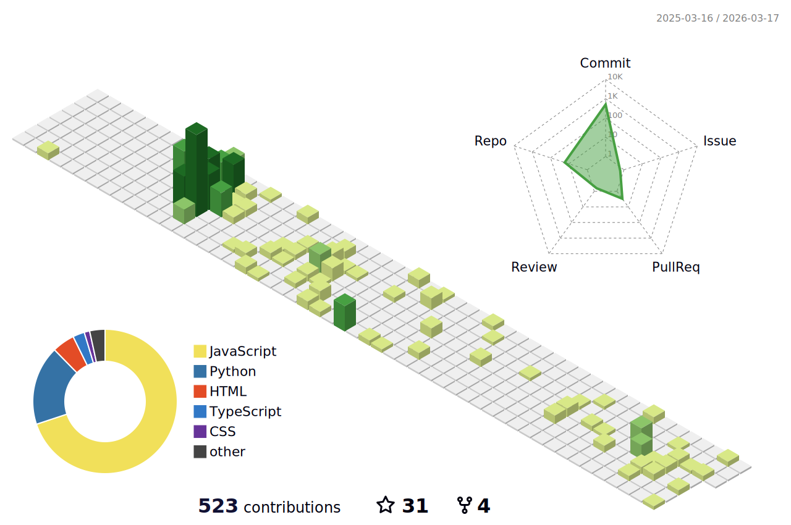

#### 🎓 Education
* 명지전문대학 소프트웨어콘텐츠과 졸업 (Unity/VR/3dsMAX)
* 전남대학교 인공지능학부 재학 (AI/Web/Mobile/Devops...)

#### 🏆 Award / Competition
* 협의회장상 (Co-Data-Station 데이터과학논술대회)
    * [seojaeoh/SID](https://github.com/seojaeohcode/SID) - Skin Disease Diagnosis App.
* 우수상 (서울시 공공데이터 웹앱 경진대회)
    * [seojaeoh/Seoul_Street_Gallery](https://github.com/seojaeohcode/Seoul_Street_Gallery) - Public Art Exploration & Community Bulletin Web Project.
* DGB 금융그룹 IT's DGB, iM Challenger()
* 2022 산업통상자원부 Efesta 창의적종합설계 경진대회 
   * [seojaeoh/BlendA](https://github.com/seojaeohcode/BlendA) - VR Bartender Job Experience Game.   
* 호남정보보호 해커톤 참가 (CTF 지오파디 방식)

#### 🛠️ Open Source

* [Thegull](https://github.com/seojaeohcode/The-Gull)

#### :memo: Misc
* K-MOVE 미국 백엔드 개발자 과정 수료
* DDC 2023

#### 📜 Certificate
* 정보처리산업기사
* 네트워크관리사 2급
* 리눅스마스터 2급

