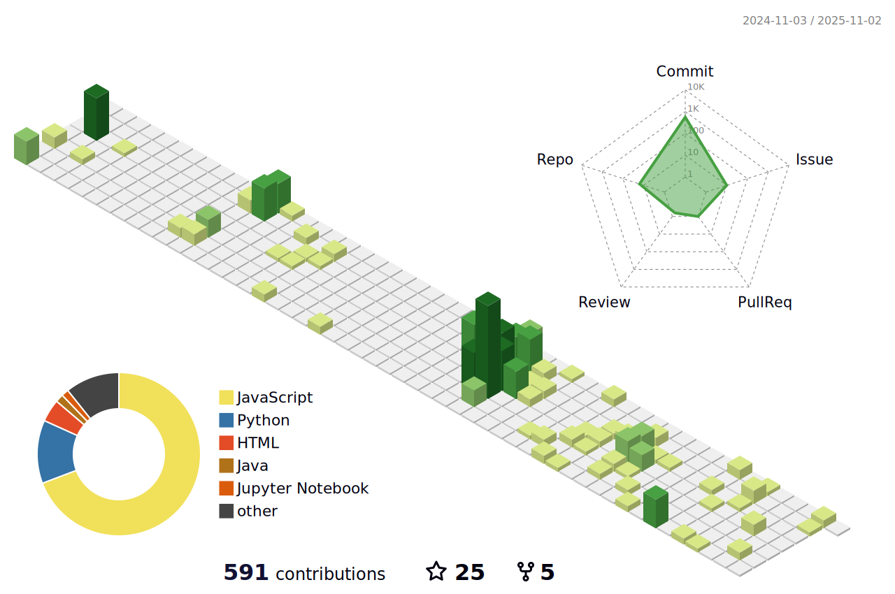

### company
* 린애자일 헝그리 AI Research(inprogress)
* RA 연구보조 (inprogress) - SWE-bench & 악성패키지 통합 업무 
* 창업직썰 인턴십 (1month)

#### 🎓 Education
* 전남대학교 학석연계 (지능형 소프트웨어 진화 & 유지 보수 연구실 석사과정)
* 전남대학교 인공지능학부 재학 (AI/Web/Mobile/Devops...)
* 명지전문대학 소프트웨어콘텐츠과 졸업 (Unity/VR/3dsMAX)

#### 🏆 Award / Competition
* 협의회장상 (Co-Data-Station 데이터과학논술대회)
    * [seojaeoh/SID](https://github.com/seojaeohcode/SID) - Skin Disease Diagnosis App.
* 우수상 (서울시 공공데이터 웹앱 경진대회)
    * [seojaeoh/Seoul_Street_Gallery](https://github.com/seojaeohcode/Seoul_Street_Gallery) - Public Art Exploration & Community Bulletin Web Project.
* DGB 금융그룹 IT's DGB, iM Challenger (본선진출)
    * [seojaeoh/PROG](https://github.com/seojaeohcode/PROG) - ESG Company Quant Investment Solution.
* 세종핵테온 (참가) (CTF 지오파디 방식)
* 2022 산업통상자원부 Efesta 창의적종합설계 경진대회 (참가)
   * [seojaeoh/BlendA](https://github.com/seojaeohcode/BlendA) - VR Bartender Job Experience Game.   
* 호남정보보호 해커톤 (참가) (CTF 지오파디 방식)
* ETRI 네트워크 해커톤
* 2025 AI융합 문제발굴 산학연계 해커톤
* AI 리터러시 단기 프로그램
* 호남권 LLM 해커톤 대회

#### 🏆 Award / PAPER
* 우수논문상 (스마트미디어학회) : 계층적 생성방식을 활용한 한국어 제목 생성의 실험적 분석
* 춘계학술지 (스마트미디어학회) : 심사중

#### project
* [A!rrange](https://github.com/seojaeohcode/Arrange) - AI 스마트 북마크 확장프로그램(지원사업 목록 : 전남대학교 클라우드 / 창업동아리 / 캡스톤)
* [Ongasa](https://github.com/seojaeohcode/Ongasa) - 한일 가사 번안 프로젝트
* [지역별 음식 가격 데이터분석](https://github.com/seojaeohcode/AI-System?tab=readme-ov-file)

#### 🛠️ Open Source
* [GRASS] : 준비중
* [atio](https://github.com/seojaeohcode/atomic-writer) - 원자적인 파일 쓰기를 지원하는 경량 Python 라이브러리 (운영중!)
* [Github-Personal-Blog-System](https://github.com/seojaeohcode/Git-Personal-Blog-System) - 깃허브 액션을 활용한 블로그 포스트 시스템
    * [Ingeniare](https://seojaeohcode.github.io/Git-Personal-Blog-System/) - Ingeniare 공학 종합 블로그
* [Thegull](https://github.com/seojaeohcode/The-Gull) - 캡스톤디자인/한국정보처리학회ACK2024 발표작

#### :memo: Misc
* 하나유니버시티 수료
* NHN 클라우드 교육
* Microsoft 데이터분석 특강
* Nvidia Cuda C/C++ 가속컴퓨팅 강의 수강
* K-MOVE 미국 백엔드 개발자 과정 수료
* DDC 2023
  
#### 📜 Certificate
* 정보처리기사
* 네트워크관리사 2급
* 리눅스마스터 2급

#### Tech
Unity(게임창업목적+캡스톤1,2학년)-React-Django-Vue-Oculus-FLASK-PostgreSQL-Firebase-AWS-Android-OpenCV-Docker-Electron-Localtunnel-Spring

#### club
* 보안동아리 PCode(동아리원)
* 창업동아리 차곡(회장)

